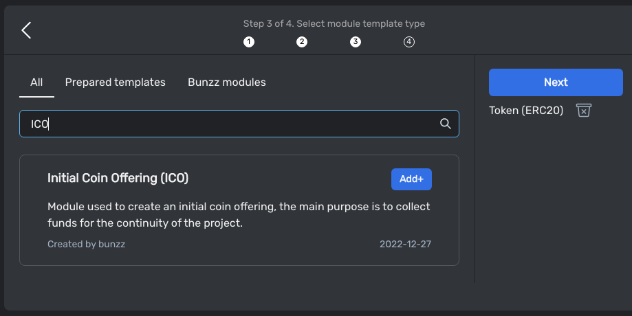
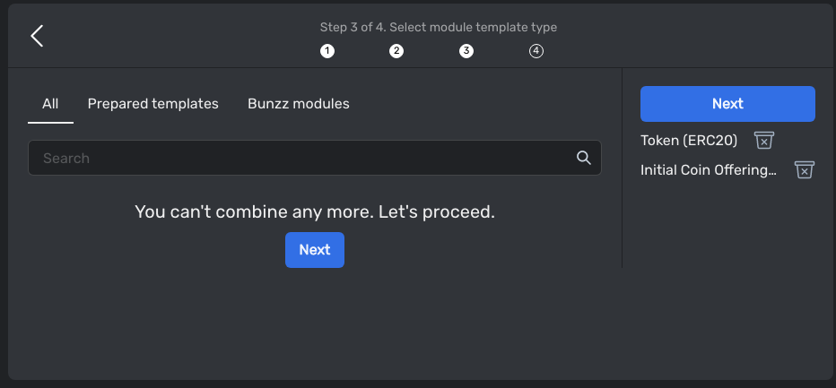
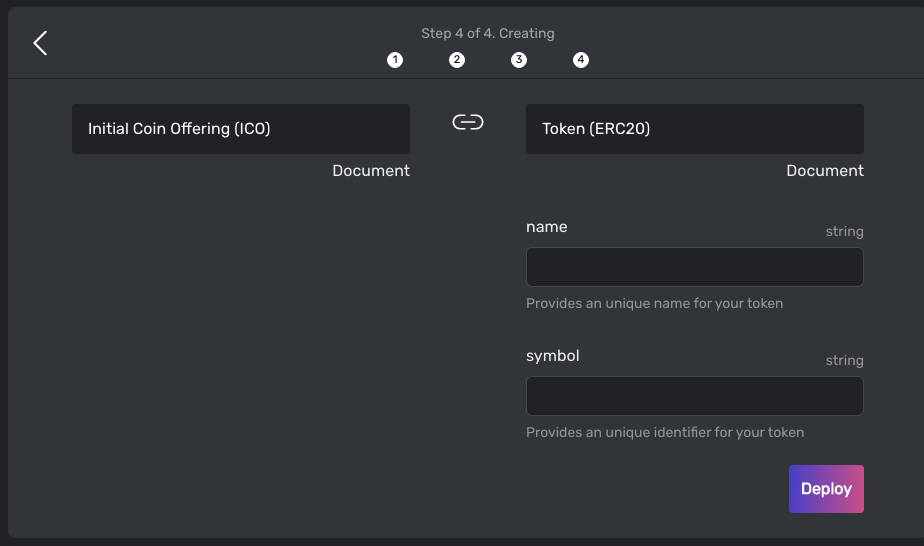
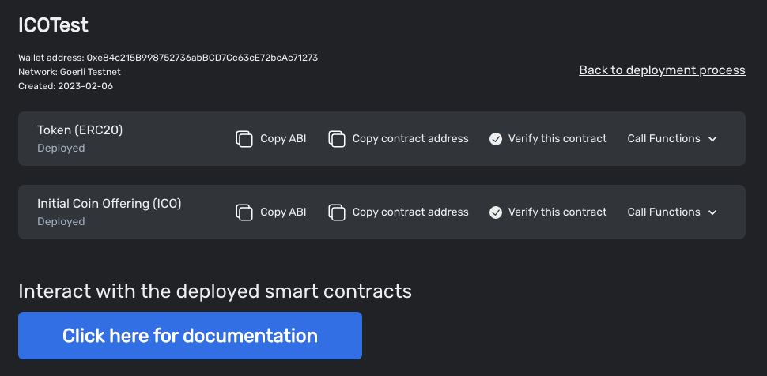
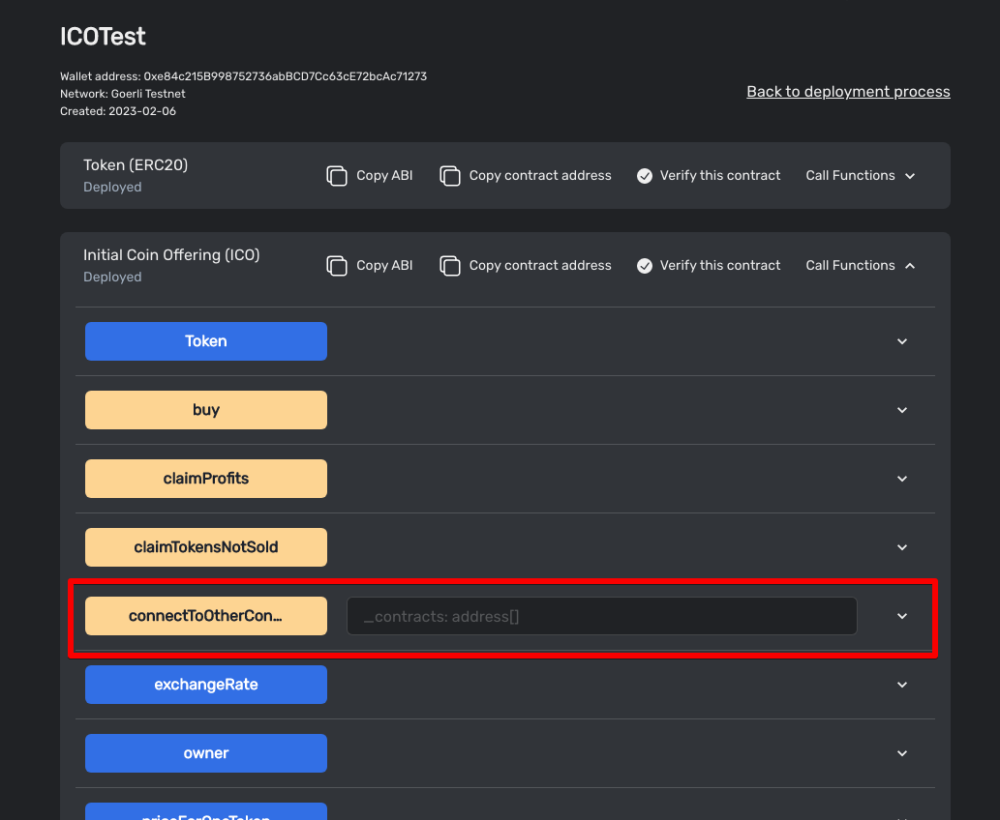

# Boilerplate for ICO & Staking

This boilerplate is for ICO & Staking application.
Using this boilerplate, you can create ICO & Staking website.


# How to create this application?

## Deploy smart contracts

### [Deploy ICO contract](https://app.bunzz.dev/module-templates/f5038e83-08c0-415e-953d-72a1dd07d111)

Please deploy ICO smart contract


If you have already an ERC20 token for ICO, you can skip this.











If you are going to use an ERC20 token already deployed, you can set the token address of ICO contract.



### [Deploy staking contract](https://app.bunzz.dev/module-templates/bc19a86b-2a94-47b6-83b2-0fc33554d6c9/how-to-use)


Please check [this guide](https://app.bunzz.dev/module-templates/bc19a86b-2a94-47b6-83b2-0fc33554d6c9/arguments) to learn more.

### Deposit tokens for ICO & Staking

- Transfer the token to ICO contract.

- Deposit the token into Staking contract using [depositReward](https://app.bunzz.dev/module-templates/bc19a86b-2a94-47b6-83b2-0fc33554d6c9/functions) function.


## Create ICO Website

### Clone ICO & Staking boilerplate repository.

Clone [this repository](https://github.com/lastrust/boilerplate-for-ICO-Staking)

```
git clone https://github.com/lastrust/boilerplate-for-ICO-Staking
```

### Install app

```
cd boilerplate-for-ICO-Staking

yarn install
```

### Add contract addresses

Please update `src/lib/web3_constants.ts` file with the smart contract addresses you deployed.

```
import { BigNumber } from 'ethers';

export const Decimals = BigNumber.from(18);
export const OneToken = BigNumber.from(10).pow(Decimals);

export const ERC20TOKEN_ADDRESS = '';
export const ICO_ADDRESS = '';
export const STAKING_ADDRESS = '';
```

### Run application

Development mode

```
yarn dev
```

Production mode

```
yarn build
yarn start
```


Now you can use this application.

To learn more, please ask in [our discord](https://discord.gg/wCFUV6rNd7)