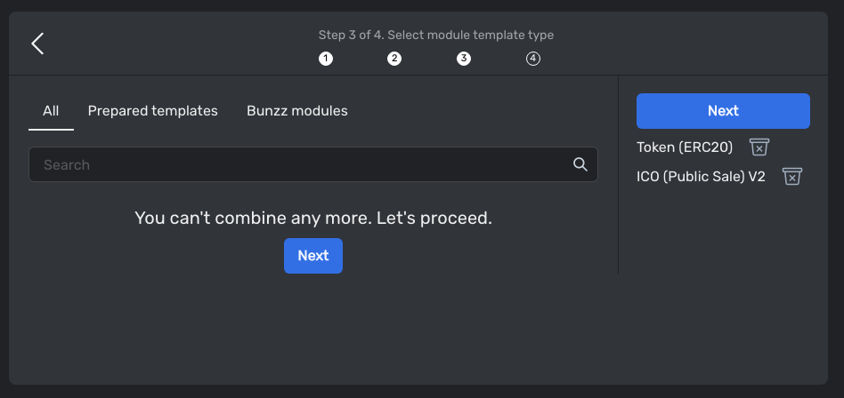

# Boilerplate for ICO & Staking

This boilerplate is for ICO & Staking application.
Using this boilerplate, you can create ICO & Staking website.


# How to create this application?

## Deploy smart contracts

### [Deploy ICO contract](https://app.bunzz.dev/module-templates/f5038e83-08c0-415e-953d-72a1dd07d111)

Please deploy ICO smart contract

- Click `Create Dapp` box


- Input DApp name


- Select the chain you want to deploy the contracts on.


- Search and select one of ERC20 token modules

If you have already an ERC20 token for ICO, you can skip this.


- Search and select [ICO (Public Sale) module](https://app.bunzz.dev/module-templates/c922eb26-35b6-4c88-a667-a51ceba650f3)




- Input token name and symbol. (If you didn't select ERC20 module, you don't need to add the token name and symbol).
- Input start time and end time in timestamp type. (endTime > startTime >= currentTime)


- Clicking `Deploy` button, you can deploy the smart contracts using metamask wallet.


Now you can see the deployed contract information on DApp dashboard page.


If you are going to use an ERC20 token already deployed, you can set the token address of ICO contract.


### [Deploy staking contract](https://app.bunzz.dev/module-templates/bc19a86b-2a94-47b6-83b2-0fc33554d6c9/how-to-use)

- Click `Create Dapp` box


- Select the chain you want to deploy the smart contracts on.


- Search and select [Staking module](https://app.bunzz.dev/module-templates/bc19a86b-2a94-47b6-83b2-0fc33554d6c9).


- Input params.

```
_stkToken: ERC20 token address for staking.
_rewardPerBlock: Amount of reward token per block.
_feeWallet: Fee wallet address.
__maxFeePercent: Max fee percent. Here is 1000 means 100%.
_harvestFee: Harvest fee percent. Here is 1000 means 100% Harvest fee can't be more than maxFeePercent.
```


Please check [this guide](https://app.bunzz.dev/module-templates/bc19a86b-2a94-47b6-83b2-0fc33554d6c9/arguments) to learn more.

### Deposit tokens for ICO & Staking

- Transfer the token to ICO contract.

- Deposit the token into Staking contract using [depositReward](https://app.bunzz.dev/module-templates/bc19a86b-2a94-47b6-83b2-0fc33554d6c9/functions) function.


## Create ICO Website

### Clone ICO & Staking boilerplate repository.

Clone [this repository](https://github.com/lastrust/boilerplate-for-ICO-Staking)

```
git clone https://github.com/lastrust/boilerplate-for-ICO-Staking
```

### Install app

```
cd boilerplate-for-ICO-Staking

yarn install
```

### Add contract addresses

Please update `src/lib/web3_constants.ts` file with the smart contract addresses you deployed.

```
import {BigNumber} from 'ethers';

export const Decimals = BigNumber.from(18);
export const OneToken = BigNumber.from(10).pow(Decimals);

export const ERC20TOKEN_ADDRESS = '';
export const ICO_ADDRESS = '';
export const STAKING_ADDRESS = '';

export const CHAIN_INFO = {
  chainId: '', // chainId in hex format. It is 0x5 for goerli.
  rpcUrls: [''], // rpc url.
  chainName: '',
  nativeCurrency: {
    name: 'ETH',
    symbol: 'ETH',
    decimals: 18,
  },
  blockExplorerUrls: [''], // https://goerli.etherscan.io
};
```

### Run application

Development mode

```
yarn dev
```

Production mode

```
yarn build
yarn start
```


Now you can use this application.

To learn more, please ask in [our discord](https://discord.gg/wCFUV6rNd7)